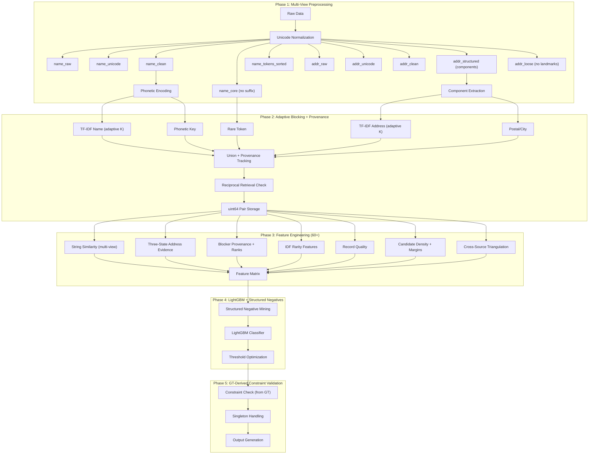

# Amazon ML Challenge 2026: Business Entity Resolution
## Elite Implementation Plan (v3 — Battle-Tested)

---

> [!IMPORTANT]
> **Dataset Scale**: S1=2.2M, S2=5M, S3=5.3M records (train) | S1=1.7M, S2=4.9M, S3=5.1M (test)
> **Countries**: US (60%), India (40%) in train; US, India, **France (15%)** in test (unseen)
> **Singletons**: 5.6% of S1 entities have zero matches
> **Avg matches**: 3.67 per matched entity (max 11)
> **Missing addresses**: ~169K in S2, ~176K in S3
> **Scripts observed**: Latin, Devanagari, Tamil, Kannada, Gurmukhi + French diacritics

---

## Key Data Observations from EDA

| Observation | Detail | Implication |
|---|---|---|
| **Name noise** | Typos (`Construcrion`, `ENRTPRMISES`, `Etrepndiels`), abbreviations (`Pvt`/`Private`/`P`), reorderings, DBA names, punctuation (`LLC` vs `L.L.C` vs `(LLC)`) | Multi-view name normalization + fuzzy matching |
| **Indic scripts** | Tamil (`ராஜ் இன்வெஸ்ட்மெண்ட்ஸ்`), Hindi (`एसएस फूड`), Kannada (`ಕರ್ನಾಟಕ`), Gurmukhi (`ਪੰਜਾਬ`) — sometimes mixed with English in the same record | Preserve both unicode and transliterated views |
| **Address noise** | Case variations, abbreviations, missing components, landmark-based refs, transliteration, component reordering, `null` addresses | Three-state evidence (match/missing/conflict) |
| **France (unseen)** | French suffixes (`SARL`, `SAS`, `EURL`, `SCI`, `SELARL`), French address format (`Rue`, `Boulevard`) | No hardcoded country logic; global fallback threshold |
| **Null addresses** | S2: 168,967; S3: 175,916 null addresses | Name-only fallback; record quality features |
| **URL-as-name** | `maurewilliamscolombier.com` used as business name in S3 | `is_url_name` quality flag |
| **Source profiles** | S2: UPPERCASE registry format; S3: informal, more typos, URLs | `source_type` feature; source-aware noise models |

---

## Architecture Overview



---

## Phase 1: Multi-View Preprocessing (Non-Destructive)

> [!IMPORTANT]
> **Design principle**: Never destroy information. Create parallel representations at different normalization levels. Features can pick the right view for each comparison.

### 1.1 Text Cleaning Pipeline

```python
import regex  # unicode-aware regex, used for script detection

def preprocess_record(row):
    name_raw = str(row['business_name']).strip()
    addr_raw = str(row['business_address']).strip()

    # View 1: Unicode-normalized (fix encoding, normalize forms)
    name_unicode = ftfy.fix_text(unicodedata.normalize('NFKC', name_raw))
    addr_unicode = ftfy.fix_text(unicodedata.normalize('NFKC', addr_raw))

    # View 2: Transliterated (Indic -> Latin) — KEEP ORIGINALS
    name_transliterated = unidecode(name_unicode)
    addr_transliterated = unidecode(addr_unicode)

    # View 3: URL extraction (BEFORE cleaning strips URLs)
    is_url, url_domain, url_stem = extract_url_name(name_transliterated)

    # View 4: Cleaned (lowercase, punct normalized)
    # NOTE: if name is a URL, clean the domain stem — do NOT discard it
    if is_url:
        name_clean = clean_text(url_stem)   # "maurewilliamscolombier"
    else:
        name_clean = clean_text(name_transliterated)
    addr_clean = clean_text(addr_transliterated)

    # View 5: Core (legal suffixes removed, generic tokens preserved)
    name_core, legal_suffix, generic_tokens = extract_suffix_and_generics(name_clean)

    # View 6: Sorted tokens (for blocking)
    name_tokens_sorted = sorted(tokenize(name_core))

    # Address views
    addr_structured = extract_components(addr_clean)  # {city, state, postal, street_num, ...}
    addr_without_landmark, landmark_tokens = extract_landmarks(addr_clean)

    # Script detection (using regex lib, NOT unicodedata.script)
    script_type = detect_script(name_raw)

    return {
        'name_raw': name_raw,
        'name_unicode': name_unicode,
        'name_transliterated': name_transliterated,
        'name_clean': name_clean,
        'name_core': name_core,
        'legal_suffix': legal_suffix,
        'generic_tokens': generic_tokens,
        'name_tokens_sorted': name_tokens_sorted,
        'is_url_name': is_url,
        'url_domain': url_domain,
        'url_stem': url_stem,
        'addr_raw': addr_raw,
        'addr_unicode': addr_unicode,
        'addr_transliterated': addr_transliterated,
        'addr_clean': addr_clean,
        'addr_structured': addr_structured,
        'addr_without_landmark': addr_without_landmark,
        'landmark_tokens': landmark_tokens,
        'script_type': script_type,
        'transliteration_used': (script_type != 'latin'),
    }


def extract_url_name(name):
    """
    Detect URL-as-name records (common in S3) and extract usable parts.
    e.g. "maurewilliamscolombier.com" -> domain="maurewilliamscolombier.com",
                                          stem="maurewilliamscolombier"
    """
    url_pattern = regex.compile(
        r'^(?:https?://)?([a-z0-9][-a-z0-9]*(?:\.[a-z0-9][-a-z0-9]*)*\.[a-z]{2,})$',
        regex.IGNORECASE
    )
    match = url_pattern.match(name.strip())
    if match:
        domain = match.group(1).lower()
        # Strip TLD (.com, .org, .in, .fr, etc.)
        stem = regex.sub(r'\.[a-z]{2,}$', '', domain)
        # Strip www prefix
        stem = regex.sub(r'^www\.', '', stem)
        return True, domain, stem
    return False, None, name
```

### 1.2 Business Name Normalization (Multiple Views)

| View | Description | Used For |
|---|---|---|
| `name_raw` | Original string as-is | Unicode similarity features |
| `name_unicode` | NFKC-normalized, encoding fixed | Unicode-level comparisons |
| `name_transliterated` | Indic scripts converted to Latin via `unidecode` | Cross-script matching |
| `name_clean` | Lowercased, punct normalized. **If URL**: uses domain stem instead of discarding | Primary similarity features |
| `name_core` | Legal suffixes removed (generic tokens preserved separately) | Core identity matching |
| `name_tokens_sorted` | Alphabetically sorted token set | Blocking key generation |
| `url_domain` | Full domain if name was a URL, else `None` | URL-to-name cross-matching |
| `url_stem` | Domain without TLD (e.g. `maurewilliamscolombier`) | Compare against business names |

**Legal suffix vs. generic token separation**:

> [!WARNING]
> **Critical distinction**: Legal suffixes (`LLC`, `Pvt`, `Ltd`, `SARL`) are purely structural decoration and safe to strip for `name_core`. Generic business words (`Enterprises`, `Holdings`, `Group`) are **identity-bearing** — "ABC Holdings" and "ABC" are not necessarily the same entity. Do NOT conflate them.

```python
# LEGAL SUFFIXES — safe to strip for name_core
LEGAL_SUFFIXES = {
    # US
    'llc', 'inc', 'corp', 'corporation', 'co', 'lp', 'llp',
    # India
    'pvt', 'private', 'ltd', 'limited', 'opc',
    # France
    'sarl', 'sas', 'sasu', 'sa', 'eurl', 'sci', 'snc', 'selarl', 'ste',
    # Other
    'dba', 'company',
}

# GENERIC TOKENS — NOT stripped, but tracked separately as features
GENERIC_BUSINESS_TOKENS = {
    'group', 'holdings', 'enterprises', 'foundation', 'associates',
    'partners', 'solutions', 'services', 'international', 'industries',
    'technologies', 'consultants', 'agency', 'studio', 'ventures',
}

def extract_suffix_and_generics(name_clean):
    """Separate legal suffixes (removable) from generic tokens (features)."""
    tokens = name_clean.split()
    legal = [t for t in tokens if t in LEGAL_SUFFIXES]
    generic = [t for t in tokens if t in GENERIC_BUSINESS_TOKENS]
    core_tokens = [t for t in tokens
                   if t not in LEGAL_SUFFIXES]  # keep generic tokens in core!
    name_core = ' '.join(core_tokens)
    return name_core, legal, generic
```

**Features derived from this separation**:

| Feature | Description |
|---|---|
| `suffix_compatible` | Are legal suffixes semantically compatible? (e.g. both LLC) |
| `generic_token_overlap` | Jaccard on generic tokens between pair |
| `generic_token_count` | How many generic tokens are shared |
| `core_without_generics_similarity` | Similarity after removing BOTH suffixes and generics |

> [!TIP]
> **Key change from v1**: Features are computed at multiple normalization levels:
> - `name_core_similarity` — identity without legal decoration
> - `name_full_similarity` — full string including suffix
> - `suffix_compatibility` — are legal suffixes semantically compatible?
> This prevents information loss from aggressive normalization.

### 1.3 Address Normalization (Structured Components)

| Step | Description |
|---|---|
| **Abbreviation expansion** | `rd -> road`, `st -> street`, `ave -> avenue`, `r. -> rue`, etc. |
| **Number normalization** | `NO. 5 -> 5`, `#8 -> 8`, `2260- -> 2260` |
| **Postal code extraction** | Regex: India 6-digit, US 5-digit, France 5-digit |
| **City extraction** | **Heuristic/structural only** — NO external city database (compliance) |
| **State standardization** | Map abbreviations to full names using mappings derived from training data only |
| **Landmark extraction** | Extract but **preserve** phrases like `near`, `behind`, `opposite` as separate field |

> [!CAUTION]
> **Compliance**: City/state extraction uses ONLY regex heuristics and dictionaries built from the training+test data itself. No external geographic databases, geocoding APIs, or internet lookups. The challenge explicitly prohibits this.

**City extraction approach**:
```python
# Build city dictionary from training data itself
def build_city_dictionary(all_addresses):
    """Extract candidate city names by structural position in addresses."""
    # Cities typically appear as a comma-separated component
    # after street info and before state/postal code
    city_candidates = Counter()
    for addr in all_addresses:
        parts = addr.split(',')
        if len(parts) >= 3:
            city_candidates[parts[-2].strip().lower()] += 1
    # Filter by frequency to get real city names
    return {c for c, count in city_candidates.items() if count >= 5}
```

### 1.4 Script Detection and Preservation

> [!WARNING]
> **Do NOT use `unicodedata.script()`** — it requires Python 3.13+ and is unavailable in most production environments. Use the `regex` library (already a dependency) which provides robust Unicode property support across all Python 3.x versions.

```python
import regex
from collections import Counter

# Script detection patterns using regex Unicode properties
_SCRIPT_PATTERNS = [
    ('devanagari', regex.compile(r'\p{Script=Devanagari}')),
    ('tamil',      regex.compile(r'\p{Script=Tamil}')),
    ('kannada',    regex.compile(r'\p{Script=Kannada}')),
    ('gurmukhi',   regex.compile(r'\p{Script=Gurmukhi}')),
    ('latin',      regex.compile(r'\p{Script=Latin}')),
]

def detect_script(text):
    """Detect dominant script using regex Unicode properties."""
    counts = Counter()
    for name, pattern in _SCRIPT_PATTERNS:
        hits = len(pattern.findall(text))
        if hits > 0:
            counts[name] = hits
    if not counts:
        return 'unknown'
    if len(counts) > 1:
        # Check if dominant script is >80% of characters
        total = sum(counts.values())
        dominant_name, dominant_count = counts.most_common(1)[0]
        if dominant_count / total > 0.8:
            return dominant_name
        return 'mixed'
    return counts.most_common(1)[0][0]
```

**Features from script preservation**:

| Feature | Description |
|---|---|
| `same_script` | Binary: do both records use the same dominant script? |
| `unicode_name_similarity` | Similarity on pre-transliteration unicode text |
| `transliterated_name_similarity` | Similarity on post-transliteration text |
| `script_type_s1` / `script_type_candidate` | Categorical script type |
| `url_stem_vs_name_similarity` | If one record is URL: similarity of domain stem to other's name |

---

## Phase 2: Adaptive Blocking with Provenance Tracking

> [!IMPORTANT]
> **Three key changes from v1**:
> 1. **Adaptive K** — more candidates for ambiguous entities, fewer for unique ones
> 2. **Provenance tracking** — record which blockers hit and at what rank
> 3. **Integer-encoded storage** — uint64 pair keys instead of Python set of tuples

### 2.1 Blocking Strategy Table

| # | Strategy | Key Construction | Role |
|---|---|---|---|
| 1 | **TF-IDF Name** | Country + char 3-5gram TF-IDF cosine top-K on `name_clean` | Primary workhorse |
| 2 | **TF-IDF Address** | Country + word TF-IDF cosine top-K on `addr_clean` | Catches address-similar pairs |
| 3 | **Phonetic Name** | Country + Double Metaphone of first name token | Catches phonetic matches |
| 4 | **Rare Token** | Country + Any shared name token with IDF > threshold | High-precision signal |
| 5 | **Postal + Prefix** | Country + Postal code + first 3 chars of `name_clean` | Address-anchored |
| 6 | **City + Bigram** | Country + extracted city + shared name char bigram | Geographic anchor |

### 2.2 Adaptive K Selection

> [!IMPORTANT]
> **The concept of adaptive K is correct, but the IDF thresholds (8/5/3) must NOT be hardcoded.** Derive them from your blocking recall evaluation on validation data. The granular blocking evaluation framework (Section 2.6) provides the data to calibrate these thresholds objectively.

```python
def get_adaptive_k(entity, idf, k_config):
    """
    Unique entities need fewer candidates; ambiguous ones need more.
    k_config is calibrated from blocking eval (Section 2.6), NOT hardcoded.
    """
    tokens = [t for t in entity['name_tokens'] if t in idf]
    if not tokens:
        return k_config['max_k']  # Safety: empty names get maximum K

    max_token_idf = max(idf[t] for t in tokens)
    name_len = len(tokens)
    has_address = entity['addr_clean'] not in ('', 'nan', 'none')

    if max_token_idf > k_config['unique_idf_thresh'] and name_len >= 3:
        return k_config['unique_k']      # Very unique name
    elif max_token_idf > k_config['normal_idf_thresh'] and has_address:
        return k_config['normal_k']      # Normal name with address
    elif max_token_idf > k_config['common_idf_thresh']:
        return k_config['common_k']      # Somewhat common name
    else:
        return k_config['max_k']         # Very generic / missing address

# CALIBRATION: derive k_config from blocking recall evaluation
def calibrate_adaptive_k(blocking_eval_results, target_recall=0.995):
    """
    Use blocking eval results to find the K that achieves target recall
    for each entity-uniqueness tier.
    """
    # IDF percentiles from training data
    all_idfs = [max(idf[t] for t in e['name_tokens'] if t in idf)
                for e in entities if any(t in idf for t in e['name_tokens'])]
    p75, p50, p25 = np.percentile(all_idfs, [75, 50, 25])

    # Start with percentile-based thresholds, refine with recall measurement
    k_config = {
        'unique_idf_thresh': p75,    # top 25% uniqueness
        'normal_idf_thresh': p50,    # median
        'common_idf_thresh': p25,    # bottom 25%
        'unique_k': 15,
        'normal_k': 30,
        'common_k': 50,
        'max_k': 100,
    }
    # Validate: check that recall@K >= target_recall for each tier
    # Increase K if any tier falls below target
    return k_config
```

### 2.3 Provenance Tracking

For every candidate pair `(S1_id, candidate_id)`, record:

```python
@dataclass
class CandidateProvenance:
    name_tfidf_hit: bool = False
    name_tfidf_rank: int = -1       # rank within name TF-IDF results (-1 = not hit)
    addr_tfidf_hit: bool = False
    addr_tfidf_rank: int = -1
    phonetic_hit: bool = False
    rare_token_hit: bool = False
    postal_hit: bool = False
    city_hit: bool = False
    num_blockers_hit: int = 0       # sum of all hits
    best_block_rank: int = 999      # min rank across all strategies
```

This becomes part of the feature vector in Phase 3.

### 2.4 Reciprocal Retrieval (Independent Reverse Retrieval)

> [!WARNING]
> **Critical fix**: Reciprocal retrieval requires an **independently executed** reverse retrieval, not just re-reading the forward index. Building a reverse index from `s1_to_candidates` only tells you which S1 entities happened to retrieve a given S2/S3 — it does NOT tell you that S2/S3's own nearest-neighbor search would find that S1. Those are fundamentally different signals.

The correct approach:

```python
def run_reciprocal_retrieval(s1_tfidf, s2s3_tfidf, forward_candidates):
    """
    Step 1: Forward retrieval (already done in blocking)
        S1 x S2S3^T  ->  for each S1, top-K S2/S3 candidates

    Step 2: INDEPENDENT Reverse retrieval (new computation)
        S2S3 x S1^T  ->  for each S2/S3, top-K S1 candidates

    Step 3: Join forward + reverse ranks for each candidate pair
    """
    # ---- Step 2: Reverse retrieval ----
    # This is a SEPARATE matrix multiplication, not derived from forward results
    reverse_results = awesome_cossim_topn(
        s2s3_tfidf,          # S2/S3 as query
        s1_tfidf.T,          # S1 as corpus
        ntop=20,             # smaller K is fine for reverse (precision signal)
        lower_bound=0.3,
        n_jobs=8
    )

    # Build reverse lookup: for each S2/S3 entity, its independently-retrieved S1 neighbors
    reverse_index = {}   # cand_idx -> [(s1_idx, reverse_rank), ...]
    for cand_idx in range(reverse_results.shape[0]):
        row = reverse_results.getrow(cand_idx)
        s1_indices = row.indices
        scores = row.data
        # Sort by score descending to get rank
        ranked = sorted(zip(s1_indices, scores), key=lambda x: -x[1])
        reverse_index[cand_idx] = {s1_idx: rank for rank, (s1_idx, _) in enumerate(ranked)}

    # ---- Step 3: Join forward + reverse ranks ----
    for s1_idx, fwd_candidates in forward_candidates.items():
        for fwd_rank, cand_idx in enumerate(fwd_candidates):
            rev_ranks = reverse_index.get(cand_idx, {})
            rev_rank = rev_ranks.get(s1_idx, -1)  # -1 = not in reverse top-K at all

            yield {
                's1_to_cand_rank': fwd_rank,
                'cand_to_s1_rank': rev_rank,
                'is_mutual_top1': (fwd_rank == 0 and rev_rank == 0),
                'is_mutual_top5': (fwd_rank < 5 and 0 <= rev_rank < 5),
                'reciprocal_rank_product': (
                    (1.0 / (fwd_rank + 1)) * (1.0 / (rev_rank + 1))
                    if rev_rank >= 0 else 0.0
                ),
            }
```

> [!TIP]
> **Reciprocal retrieval is one of the strongest precision signals.** If S1-A's top match is S2-X **AND** an independent S2-X->S1 search also returns S1-A at the top, that is extremely strong mutual evidence. This directly helps F0.5.
>
> The reverse retrieval uses a smaller K (20 vs 50) since it's only needed for rank features, not for candidate generation. This keeps compute manageable.

### 2.5 Integer-Encoded Pair Storage

> [!WARNING]
> At 1.7M S1 x 50-100 candidates = 85M-170M pairs, Python `set()` of tuples will consume 20-50GB of RAM from object overhead alone. Use integer encoding.

```python
import numpy as np

def encode_pairs(s1_indices, cand_indices):
    """Encode pair as single uint64 for memory-efficient storage."""
    # s1_indices and cand_indices are uint32 integer indices (not string IDs)
    s1 = s1_indices.astype(np.uint64)
    cand = cand_indices.astype(np.uint64)
    return (s1 << 32) | cand

def decode_pairs(encoded):
    s1 = (encoded >> 32).astype(np.uint32)
    cand = (encoded & 0xFFFFFFFF).astype(np.uint32)
    return s1, cand

# Per-country workflow:
for country in countries:
    pairs = np.empty(0, dtype=np.uint64)
    for strategy in blocking_strategies:
        new_pairs = encode_pairs(strategy.s1_idx, strategy.cand_idx)
        pairs = np.union1d(pairs, new_pairs)  # sorted unique
    # Save as parquet chunk
    save_chunk(country, pairs, provenance_data)
```

### 2.6 Granular Blocking Evaluation

```python
def evaluate_blocking(candidates_by_strategy, ground_truth, k_values=[10, 20, 50, 100]):
    """Evaluate each blocking strategy individually and the union."""
    results = {}

    for strategy_name, strategy_candidates in candidates_by_strategy.items():
        for k in k_values:
            # Truncate to top-K per S1 entity
            truncated = {s1: cands[:k] for s1, cands in strategy_candidates.items()}
            recall = compute_blocking_recall(truncated, ground_truth)
            results[f"{strategy_name}_recall@{k}"] = recall

    # Union recall at each K
    for k in k_values:
        union_candidates = merge_top_k(candidates_by_strategy, k)
        results[f"union_recall@{k}"] = compute_blocking_recall(union_candidates, ground_truth)

    # Marginal recall gain
    for k in k_values:
        if k > k_values[0]:
            prev_k = k_values[k_values.index(k) - 1]
            gain = results[f"union_recall@{k}"] - results[f"union_recall@{prev_k}"]
            results[f"marginal_gain_{prev_k}_to_{k}"] = gain

    return results
```

**Target output**:
```
name_tfidf_recall@20  = 0.943
name_tfidf_recall@50  = 0.971
addr_tfidf_recall@20  = 0.887
addr_tfidf_recall@50  = 0.921
phonetic_recall@all   = 0.856
union_recall@20       = 0.981
union_recall@50       = 0.993
union_recall@100      = 0.997
marginal_gain_50_to_100 = 0.004  <-- diminishing returns
```

This tells you objectively whether K=100 is worth the extra compute.

### 2.7 Country-Based Partitioning

> [!IMPORTANT]
> **Before locking country as an irreversible gate, verify from training GT** that no true pairs have mismatched countries. If even a small number exist (due to noisy country labels), add a narrow cross-country fallback for high-confidence name matches.

```python
# ---- STEP 0: Verify country reliability from GT ----
def verify_country_gate(ground_truth, s1_records, s2s3_records):
    """Check if any true match pairs have different country labels."""
    cross_country_pairs = 0
    total_pairs = 0
    for _, row in ground_truth.iterrows():
        if pd.isna(row['matched_entity_ids']):
            continue
        s1_country = s1_records.loc[row['source1_entity_id'], 'country']
        for mid in row['matched_entity_ids'].split(','):
            mid = mid.strip()
            cand_country = s2s3_records.loc[mid, 'country']
            total_pairs += 1
            if s1_country != cand_country:
                cross_country_pairs += 1
    rate = cross_country_pairs / total_pairs if total_pairs else 0
    print(f"Cross-country true pairs: {cross_country_pairs}/{total_pairs} ({rate:.4%})")
    return rate

# ---- STEP 1: Standard same-country blocking ----
for country in data['country'].unique():  # NOT hardcoded list
    s1_country = s1[s1.country == country]
    s2s3_country = s2s3[s2s3.country == country]
    # Run blocking within partition

# ---- STEP 2: Fallback for missing country ----
s1_no_country = s1[s1.country.isna() | (s1.country == '')]
if len(s1_no_country) > 0:
    run_blocking(s1_no_country, s2s3)

# ---- STEP 3: Narrow cross-country fallback (ONLY if GT shows need) ----
# If verify_country_gate() shows >0% cross-country rate:
#   For S1 entities with very rare/unique names (max_token_idf > high_threshold),
#   also check candidates from other countries — but ONLY top-5 by name TF-IDF.
#   This adds negligible candidate volume but catches noisy country labels.
# If verify_country_gate() shows 0%: skip this entirely.
```

---

## Phase 3: Feature Engineering (60+ Features)

> [!NOTE]
> Features are computed **only for candidate pairs** from Phase 2. Organized into 8 categories.

### 3.1 Name Similarity Features (14 features, multi-view)

| # | Feature | Description | Computed On |
|---|---|---|---|
| 1 | `name_jaro_winkler` | Jaro-Winkler similarity | `name_clean` |
| 2 | `name_levenshtein_ratio` | Normalized Levenshtein | `name_clean` |
| 3 | `name_partial_ratio` | Best substring match | `name_clean` |
| 4 | `name_token_sort_ratio` | Order-invariant token ratio | `name_clean` |
| 5 | `name_token_set_ratio` | Handles extra tokens | `name_clean` |
| 6 | `name_jaccard_tokens` | Jaccard on word tokens | `name_clean` |
| 7 | `name_jaccard_3grams` | Jaccard on char 3-grams | `name_clean` |
| 8 | `name_tfidf_cosine` | Cosine of TF-IDF vectors | `name_clean` |
| 9 | `name_overlap_coeff` | Overlap coefficient | `name_clean` |
| 10 | `name_dice_coeff` | Sorensen-Dice on tokens | `name_clean` |
| 11 | `name_core_jaro` | Jaro-Winkler on core (no suffix) | `name_core` |
| 12 | `name_core_exact` | Binary: cores identical? | `name_core` |
| 13 | `name_unicode_similarity` | Token set ratio on pre-transliteration | `name_unicode` |
| 14 | `suffix_compatible` | Are legal suffixes semantically compatible? | `legal_suffix` |

### 3.2 Address Similarity Features with Three-State Evidence (15 features)

> [!IMPORTANT]
> **Key improvement**: Replace binary match features with three-state evidence:
> - `+1` = both present and **matching**
> - `0` = one or both **missing** (neutral)
> - `-1` = both present but **conflicting** (strong negative)

| # | Feature | Description | Encoding |
|---|---|---|---|
| 1 | `addr_jaccard_tokens` | Jaccard on address tokens | float |
| 2 | `addr_token_sort_ratio` | Token sort ratio on full address | float |
| 3 | `addr_token_set_ratio` | Token set ratio on full address | float |
| 4 | `addr_tfidf_cosine` | Cosine on address TF-IDF | float |
| 5 | `addr_levenshtein` | Normalized Levenshtein | float |
| 6 | `postal_relation` | Three-state: match/missing/conflict | {-1, 0, +1} |
| 7 | `city_relation` | Three-state | {-1, 0, +1} |
| 8 | `state_relation` | Three-state | {-1, 0, +1} |
| 9 | `house_number_relation` | Three-state | {-1, 0, +1} |
| 10 | `num_address_agreements` | Count of +1 relations | int |
| 11 | `num_address_conflicts` | Count of -1 relations | int |
| 12 | `addr_numeric_overlap` | Jaccard on numeric tokens only | float |
| 13 | `addr_has_null` | Binary: either address null? | bool |
| 14 | `landmark_overlap` | Jaccard on landmark tokens | float |
| 15 | `addr_component_overlap` | Fraction of structured components matching | float |

```python
def three_state_relation(val_a, val_b):
    """Compute three-state evidence for a pair of extracted components."""
    a_missing = (val_a is None or val_a == '' or val_a == 'nan')
    b_missing = (val_b is None or val_b == '' or val_b == 'nan')

    if a_missing or b_missing:
        return 0   # neutral — missing data, not evidence either way
    elif val_a == val_b:
        return 1   # match — positive evidence
    else:
        return -1  # conflict — strong negative evidence
```

### 3.3 Blocker Provenance and Rank Features (12 features)

| # | Feature | Description |
|---|---|---|
| 1 | `name_block_hit` | Binary: retrieved by name TF-IDF blocker |
| 2 | `addr_block_hit` | Binary: retrieved by address TF-IDF blocker |
| 3 | `phonetic_block_hit` | Binary: retrieved by phonetic blocker |
| 4 | `rare_token_block_hit` | Binary: retrieved by rare token blocker |
| 5 | `postal_block_hit` | Binary: retrieved by postal+prefix blocker |
| 6 | `city_block_hit` | Binary: retrieved by city+bigram blocker |
| 7 | `num_blockers_hit` | Count of blockers that retrieved this pair |
| 8 | `best_block_rank` | Minimum rank across all block strategies |
| 9 | `name_block_rank` | Rank within name TF-IDF results (-1 if miss) |
| 10 | `addr_block_rank` | Rank within address TF-IDF results |
| 11 | `is_mutual_top5` | Binary: mutual nearest neighbor in top 5 |
| 12 | `reciprocal_rank_product` | `1 / (s1_to_cand_rank + 1) * 1 / (cand_to_s1_rank + 1)` |

> [!TIP]
> `num_blockers_hit` is one of the most informative single features. A pair retrieved by 5 out of 6 blockers is vastly more likely to be a true match than one retrieved by only 1 blocker.

### 3.4 Rarity / Information-Content Features (6 features)

| # | Feature | Description |
|---|---|---|
| 1 | `name_token_idf_sum` | Sum of IDF weights for all name tokens |
| 2 | `name_max_token_idf` | Maximum IDF of any single name token |
| 3 | `matched_token_idf_sum` | Sum of IDF weights for **shared** name tokens |
| 4 | `rare_token_exact_match` | Binary: do any rare tokens (IDF > threshold) match exactly? |
| 5 | `rare_token_count` | Count of shared rare tokens |
| 6 | `addr_token_idf_sum` | Sum of IDF weights for shared address tokens |

```python
# Conceptual: evidence = similarity * token_rarity
# A shared "roseberry" (IDF=12.3) is far more evidential than shared "construction" (IDF=2.1)

def compute_idf_weighted_overlap(tokens_a, tokens_b, idf_dict):
    shared = tokens_a & tokens_b
    if not shared:
        return 0.0, 0.0, 0
    idf_sum = sum(idf_dict.get(t, 0) for t in shared)
    max_idf = max(idf_dict.get(t, 0) for t in shared)
    rare_count = sum(1 for t in shared if idf_dict.get(t, 0) > 6.0)
    return idf_sum, max_idf, rare_count
```

### 3.5 Record Quality Features (12 features)

| # | Feature | Description |
|---|---|---|
| 1 | `s1_name_length` | Character count of S1 name |
| 2 | `cand_name_length` | Character count of candidate name |
| 3 | `s1_name_token_count` | Word count of S1 name |
| 4 | `cand_name_token_count` | Word count of candidate name |
| 5 | `s1_addr_length` | Character count of S1 address |
| 6 | `cand_addr_length` | Candidate address length |
| 7 | `name_is_url` | Binary: is candidate name a URL? |
| 8 | `name_is_too_short` | Binary: name has fewer than 3 characters? |
| 9 | `generic_name_score` | Fraction of tokens that are common/generic |
| 10 | `both_names_high_quality` | Binary: both names >10 chars, >2 tokens |
| 11 | `both_addresses_present` | Binary: neither address is null |
| 12 | `one_side_low_quality` | Binary: one record has short name OR null address |

```python
# Generic name detection using IDF
def generic_name_score(name_tokens, idf_dict, threshold=3.0):
    """Fraction of tokens with low IDF (= common/generic)."""
    if not name_tokens:
        return 1.0
    generic = sum(1 for t in name_tokens if idf_dict.get(t, 0) < threshold)
    return generic / len(name_tokens)
```

### 3.6 Candidate Density and Score-Margin Features (8 features)

> [!IMPORTANT]
> **Critical for singleton handling and ambiguity resolution.** A high score alone is not enough — the *margin* over the next-best candidate tells you how confident you should be.

| # | Feature | Description |
|---|---|---|
| 1 | `top1_score` | Highest model probability for this S1 entity |
| 2 | `top2_score` | Second-highest probability |
| 3 | `top3_score` | Third-highest probability |
| 4 | `top1_minus_top2` | Margin between best and second-best |
| 5 | `top1_minus_top3` | Margin between best and third-best |
| 6 | `candidate_count` | Total number of candidates for this S1 entity |
| 7 | `high_score_candidate_count` | Candidates with probability > 0.5 |
| 8 | `score_entropy` | Entropy of probability distribution over candidates |

```python
# Decision logic informed by margins:
# high score + large margin  -> accept confidently
# high score + tiny margin   -> require more evidence (ambiguous)
# low score                  -> reject (likely singleton)
```

> [!NOTE]
> These features require a **two-pass approach**: first pass computes raw model scores, then density/margin features are added as a second-stage input. Can be done within a single model via post-hoc feature augmentation or via a stacked/two-stage model.

### 3.7 Cross-Source Triangulation Features (4 features)

| # | Feature | Description |
|---|---|---|
| 1 | `best_S2_bridge_score` | For an S1-S3 pair: best score of any S2 record that matches both |
| 2 | `best_S3_bridge_score` | For an S1-S2 pair: best score of any S3 record that matches both |
| 3 | `num_supporting_bridges` | Count of bridge records from the other source |
| 4 | `bridge_name_similarity` | Name similarity between candidate and best bridge |

```python
# Conceptual triangulation:
#
# S1-A <---strong---> S2-X
#   |                   |
#   +---moderate---> S3-Y <---strong--- S2-X
#
# The S2-X record bridges S1-A to S3-Y
# Even though S1-A <-> S3-Y is only moderate,
# the S2-X bridge provides supporting evidence.

def compute_triangulation(s1_id, cand_id, cand_source, all_scores):
    """
    For S1-S3 pair: find S2 records that score highly with both S1 and S3.
    For S1-S2 pair: find S3 records that score highly with both S1 and S2.
    """
    bridge_source = 'S2' if cand_source == 'S3' else 'S3'
    bridge_scores = []

    for bridge_id in get_candidates(s1_id, source=bridge_source):
        score_s1_bridge = all_scores.get((s1_id, bridge_id), 0)
        score_bridge_cand = compute_similarity(bridge_id, cand_id)
        if score_s1_bridge > 0.5 and score_bridge_cand > 0.5:
            bridge_scores.append(min(score_s1_bridge, score_bridge_cand))

    return {
        'best_bridge_score': max(bridge_scores) if bridge_scores else 0.0,
        'num_supporting_bridges': len(bridge_scores),
    }
```

> [!CAUTION]
> **Do NOT use transitive closure as a hard rule.** Use bridge evidence as features fed to the ML model. The model learns when triangulation is reliable vs. noisy.

### 3.8 Meta Features (6 features)

| # | Feature | Description |
|---|---|---|
| 1 | `country_match` | Binary: same country? |
| 2 | `source_type` | Categorical: S2 or S3 |
| 3 | `combined_score` | 0.6 x name_tfidf + 0.4 x addr_tfidf |
| 4 | `name_in_addr` | Binary: business name tokens appear in address? |
| 5 | `name_length_ratio` | min(len1,len2) / max(len1,len2) |
| 6 | `token_count_difference` | abs(token_count_s1 - token_count_cand) |

---

## Phase 4: ML Matching Model

### 4.1 Structured Negative Mining

> [!WARNING]
> **Critical fix from v1**: Never mine hard negatives from the validation set. That contaminates your evaluation. Use train-only out-of-fold predictions.

```python
def construct_training_pairs(gt, blocking_candidates, all_records, idf_dict):
    """
    Structured negative composition:
    - 25% random negatives (easy baseline)
    - 25% same-name / generic-name negatives (name ambiguity)
    - 25% same-city / same-address negatives (geographic ambiguity)
    - 25% hard negatives (highest false-positive scores from OOF)
    """
    positives = extract_positive_pairs(gt)

    # Random negatives: any blocking candidate that is not a true match
    random_negs = sample_random_negatives(blocking_candidates, gt, n=len(positives))

    # Same-name negatives: candidates with similar names but different entities
    name_negs = sample_same_name_negatives(blocking_candidates, gt, all_records, n=len(positives))

    # Same-city negatives: candidates in same city but different entities
    city_negs = sample_same_city_negatives(blocking_candidates, gt, all_records, n=len(positives))

    # Hard negatives: from out-of-fold predictions on TRAINING data only
    hard_negs = []  # populated after first model pass (see below)

    return positives, random_negs, name_negs, city_negs, hard_negs


def mine_hard_negatives_oof(model, X_train, y_train, train_pairs, n_folds=5):
    """
    Out-of-fold hard negative mining.
    NEVER use validation data for this.
    """
    oof_scores = np.zeros(len(X_train))
    kf = KFold(n_splits=n_folds, shuffle=True, random_state=42)

    for train_idx, oof_idx in kf.split(X_train):
        model.fit(X_train[train_idx], y_train[train_idx])
        oof_scores[oof_idx] = model.predict_proba(X_train[oof_idx])[:, 1]

    # Hard negatives: true negatives with highest predicted probability
    hard_neg_mask = (y_train == 0) & (oof_scores > 0.5)
    return train_pairs[hard_neg_mask]
```

**Training pipeline**:
```
Pass 1: Train on {positives + random_negs + name_negs + city_negs}
         ↓
         OOF predictions on training data
         ↓
         Mine hard negatives from training data only
         ↓
Pass 2: Retrain on {positives + all 4 negative types including hard negs}
         ↓
         Evaluate on HELD-OUT validation set (never touched during training)
```

### 4.2 Model: LightGBM

```python
import lightgbm as lgb

params = {
    'objective': 'binary',
    'metric': 'binary_logloss',
    'boosting_type': 'gbdt',
    'num_leaves': 127,
    'max_depth': 8,
    'learning_rate': 0.05,
    'feature_fraction': 0.8,
    'bagging_fraction': 0.8,
    'bagging_freq': 5,
    'scale_pos_weight': neg_count / pos_count,
    'n_estimators': 1500,
    'verbose': 1,
    'n_jobs': -1,
}

model = lgb.LGBMClassifier(**params)
model.fit(
    X_train, y_train,
    eval_set=[(X_val, y_val)],
    callbacks=[lgb.early_stopping(50), lgb.log_evaluation(100)]
)
```

> [!NOTE]
> **No XGBoost ensemble by default.** Only add if validation proves meaningful improvement (>0.5% F0.5 gain). Don't double inference cost speculatively.

### 4.3 Threshold Optimization

```python
def optimize_threshold(probabilities, y_true, s1_ids, countries=None):
    """
    Sweep thresholds to maximize macro F0.5.
    Optionally optimize per-country thresholds.
    """
    if countries is None:
        # Global threshold
        best_f05, best_thresh = 0, 0.5
        for thresh in np.arange(0.30, 0.95, 0.005):
            preds = (probabilities >= thresh).astype(int)
            f05 = compute_macro_f05(preds, y_true, s1_ids)
            if f05 > best_f05:
                best_f05, best_thresh = f05, thresh
        return {'global': best_thresh}
    else:
        # Per-country thresholds
        thresholds = {}
        for country in set(countries):
            mask = np.array(countries) == country
            best_f05, best_thresh = 0, 0.5
            for thresh in np.arange(0.30, 0.95, 0.005):
                preds = (probabilities[mask] >= thresh).astype(int)
                f05 = compute_macro_f05(preds, y_true[mask], s1_ids[mask])
                if f05 > best_f05:
                    best_f05, best_thresh = f05, thresh
            thresholds[country] = best_thresh
        return thresholds
```

**Threshold strategy for test set**:

```python
# Train data has US and India -> optimize separate thresholds
# France is UNSEEN -> use global threshold (not India's threshold)

thresh_us = optimized['US']
thresh_india = optimized['India']
thresh_global = optimize_on_all_train_data()  # single threshold on all train data

# At inference:
for s1_id, prob in predictions.items():
    country = s1_country[s1_id]
    if country == 'US':
        threshold = thresh_us
    elif country == 'India':
        threshold = thresh_india
    else:
        threshold = thresh_global  # Any unseen country gets global threshold
```

### 4.4 Two-Stage Refinement (for Density Features)

> [!WARNING]
> **Critical: Stage-1 scores used for Stage-2 TRAINING must be out-of-fold.** If you score training examples with a Stage-1 model trained on those same examples, the scores will be overly optimistic (the model "remembers" them). This leaks information into Stage 2 and inflates validation metrics.

```python
# ===== TRAINING: OOF Stage-1 scores =====
# Stage-1 scores for training data MUST be out-of-fold
from sklearn.model_selection import KFold

def generate_oof_stage1_scores(X_train, y_train, s1_ids_train, n_folds=5):
    """Generate Stage-1 scores via OOF to avoid information leakage."""
    oof_scores = np.zeros(len(X_train))
    kf = KFold(n_splits=n_folds, shuffle=True, random_state=42)

    for fold_train_idx, fold_oof_idx in kf.split(X_train):
        fold_model = lgb.LGBMClassifier(**params)
        fold_model.fit(X_train[fold_train_idx], y_train[fold_train_idx])
        oof_scores[fold_oof_idx] = fold_model.predict_proba(
            X_train[fold_oof_idx]
        )[:, 1]

    return oof_scores

# OOF Stage-1 scores for training
oof_stage1_scores = generate_oof_stage1_scores(X_train, y_train, s1_ids_train)

# Compute density/margin features from OOF Stage-1 scores
train_density = compute_density_features(oof_stage1_scores, s1_ids_train)
# -> top1_score, top1_minus_top2, candidate_count, score_entropy, ...

# Train Stage-2 model on augmented features (with OOF-derived density)
X_train_augmented = np.hstack([X_train, train_density])
stage2_model = lgb.LGBMClassifier(**stage2_params)
stage2_model.fit(X_train_augmented, y_train)

# ===== INFERENCE: genuine Stage-1 scores =====
# Validation and test use genuine Stage-1 inference (no leakage concern)
stage1_model = lgb.LGBMClassifier(**params)
stage1_model.fit(X_train, y_train)  # full training set

stage1_scores = stage1_model.predict_proba(X_test)[:, 1]
test_density = compute_density_features(stage1_scores, s1_ids_test)
X_test_augmented = np.hstack([X_test, test_density])
stage2_scores = stage2_model.predict_proba(X_test_augmented)[:, 1]

# Final threshold
final_predictions = stage2_scores >= threshold
```

---

## Phase 5: GT-Derived Constraint Validation

### 5.1 Constraint Discovery from Training Ground Truth

> [!IMPORTANT]
> **Do NOT assume constraints. Verify them from ground truth first.**

```python
def discover_constraints(ground_truth):
    """Check whether S2/S3 entities can match multiple S1 entities."""
    reverse_map = defaultdict(set)  # candidate_id -> set of S1 IDs
    for _, row in ground_truth.iterrows():
        s1_id = row['source1_entity_id']
        if pd.notna(row['matched_entity_ids']):
            for mid in row['matched_entity_ids'].split(','):
                reverse_map[mid.strip()].add(s1_id)

    # Check max sharing
    max_s1_per_s2 = max(len(v) for k, v in reverse_map.items() if k.startswith('S2'))
    max_s1_per_s3 = max(len(v) for k, v in reverse_map.items() if k.startswith('S3'))

    print(f"Max S1 entities sharing one S2 record: {max_s1_per_s2}")
    print(f"Max S1 entities sharing one S3 record: {max_s1_per_s3}")

    # If max == 1, uniqueness constraint is valid
    # If max > 1, do NOT enforce uniqueness
    return {
        's2_unique': (max_s1_per_s2 == 1),
        's3_unique': (max_s1_per_s3 == 1),
    }
```

### 5.2 Constraint-Aware Conflict Resolution

```python
def resolve_conflicts(predictions, constraints):
    """
    If GT shows uniqueness constraint, resolve conflicts.
    Otherwise, allow shared matches.
    """
    if not constraints['s2_unique'] and not constraints['s3_unique']:
        return predictions  # No constraint to enforce

    # Build reverse index
    reverse = defaultdict(list)  # candidate -> [(s1_id, confidence)]
    for s1_id, matches in predictions.items():
        for cand_id, conf in matches:
            reverse[cand_id].append((s1_id, conf))

    # Resolve conflicts: keep highest confidence
    resolved = defaultdict(list)
    for cand_id, claimants in reverse.items():
        source = 'S2' if cand_id.startswith('S2') else 'S3'
        if constraints.get(f'{source.lower()}_unique', False) and len(claimants) > 1:
            # Keep only the highest-confidence claimant
            best = max(claimants, key=lambda x: x[1])
            resolved[best[0]].append(cand_id)
        else:
            for s1_id, conf in claimants:
                resolved[s1_id].append(cand_id)

    return resolved
```

### 5.3 Singleton Handling

```python
# Singletons: S1 entities with no candidates exceeding threshold
# Correctly predicting empty = 1.0 score for that entity
# Incorrectly predicting any match = 0.0 score

# Key insight: density features help here
# If an entity has many weak candidates but none strong,
# it's likely a singleton. The margin features capture this.
```

### 5.4 Output Generation

```python
def generate_outputs(predictions, blocking_candidates, all_s1_ids):
    # matching_results.tsv
    matching_rows = []
    for s1_id in all_s1_ids:
        matched = predictions.get(s1_id, [])
        matching_rows.append({
            'source1_entity_id': s1_id,
            'matched_entity_ids': ','.join(matched) if matched else ''
        })
    pd.DataFrame(matching_rows).to_csv(
        'output/matching_results.tsv', sep='\t', index=False
    )

    # candidate_pairs.tsv
    candidate_rows = []
    for s1_id in all_s1_ids:
        cands = blocking_candidates.get(s1_id, [])
        candidate_rows.append({
            'source1_entity_id': s1_id,
            'candidate_entity_ids': ','.join(cands) if cands else ''
        })
    pd.DataFrame(candidate_rows).to_csv(
        'output/candidate_pairs.tsv', sep='\t', index=False
    )

    # Validation check: every match must be in candidates
    for s1_id, matched in predictions.items():
        cands = set(blocking_candidates.get(s1_id, []))
        orphans = set(matched) - cands
        if orphans:
            print(f"WARNING: {s1_id} has matches not in candidates: {orphans}")
```

---

## Project Structure

```
Amazon_ML_Challenge/
|-- student_resource/
|   |-- dataset/
|   |   |-- train/
|   |   +-- test/
|   +-- utils/
|       +-- validate_submission.py
|-- code/
|   +-- business_entity_resolution/
|       |-- src/
|       |   |-- config.py                 # All hyperparameters and paths
|       |   |-- preprocessing.py          # Phase 1: Multi-view cleaning
|       |   |-- blocking.py               # Phase 2: Adaptive blocking + provenance
|       |   |-- features.py               # Phase 3: 60+ feature engineering
|       |   |-- model.py                  # Phase 4: LightGBM + structured negatives
|       |   |-- postprocessing.py         # Phase 5: GT-derived constraint validation
|       |   |-- evaluate.py               # F0.5 scoring + blocking evaluation
|       |   |-- pipeline.py               # End-to-end orchestrator
|       |   +-- utils.py                  # Shared utilities
|       |-- README.md
|       +-- requirements.txt
|-- output/
|   |-- matching_results.tsv
|   +-- candidate_pairs.tsv
+-- Documentation_template.md
```

---

## Requirements (Key Dependencies)

```
pandas>=2.0
numpy>=1.24
scikit-learn>=1.3
lightgbm>=4.0
rapidfuzz>=3.0              # Fast fuzzy string matching (C++ backend)
jellyfish>=1.0              # Phonetic algorithms (Metaphone, Jaro-Winkler)
sparse_dot_topn>=1.0        # Fast sparse matrix top-N cosine similarity
unidecode>=1.3              # Unicode transliteration
ftfy>=6.0                   # Fix text encoding issues
regex>=2023.0               # Unicode-aware regex
tqdm>=4.65                  # Progress bars
joblib>=1.3                 # Parallel processing
pyarrow>=12.0               # Parquet I/O for chunked pair storage
```

> [!NOTE]
> **Removed from v1**: `xgboost` (only add if proven needed), `sentence-transformers` (optional experiment, not architectural dependency). This keeps the core pipeline lean and fast.

---

## Execution Timeline and Resource Plan

| Phase | Task | Est. Time (16-core CPU) | Memory |
|---|---|---|---|
| **1** | Multi-view preprocessing | ~20 min | ~35 GB |
| **2** | Adaptive blocking + provenance | ~60 min | ~40 GB |
| **2** | Reciprocal retrieval computation | ~15 min | ~20 GB |
| **2** | Blocking evaluation | ~10 min | ~5 GB |
| **3** | Feature computation (60+ features) | ~90 min | ~30 GB |
| **4** | Structured negative mining (OOF) | ~20 min | ~15 GB |
| **4** | LightGBM training (Pass 1 + 2) | ~25 min | ~15 GB |
| **4** | Threshold optimization | ~5 min | ~5 GB |
| **4** | Two-stage refinement | ~20 min | ~10 GB |
| **5** | Constraint validation + output | ~15 min | ~10 GB |
| | **Total** | **~4.5 hours** | **Peak ~40 GB** |

> [!WARNING]
> Memory management is critical at this scale:
> - `dtype=np.float32` everywhere (halves memory)
> - Sparse matrices for TF-IDF
> - `uint64` pair encoding (not Python tuples)
> - Process by country partition to reduce peak memory
> - `gc.collect()` between phases
> - Chunked parquet I/O for candidate pairs

---

## Validation Strategy

### Train/Validation Split

```python
from sklearn.model_selection import train_test_split

s1_ids = gt['source1_entity_id'].values
is_singleton = gt['matched_entity_ids'].isna().values
countries = s1.set_index('entity_id').loc[s1_ids, 'country'].values

strat_key = [f"{c}_{s}" for c, s in zip(countries, is_singleton)]

train_ids, val_ids = train_test_split(
    s1_ids, test_size=0.15, random_state=42, stratify=strat_key
)

# CRITICAL: validation set is ONLY for final evaluation
# NEVER mine hard negatives from val set
# NEVER retrain on val set
```

### F0.5 Evaluation Function

```python
def compute_macro_f05(predictions: dict, ground_truth: dict) -> float:
    scores = []
    for s1_id in ground_truth:
        true = ground_truth[s1_id]
        pred = predictions.get(s1_id, set())

        if len(true) == 0 and len(pred) == 0:
            scores.append(1.0)
        elif len(pred) == 0:
            scores.append(0.0)
        elif len(true) == 0:
            scores.append(0.0)
        else:
            tp = len(true & pred)
            precision = tp / len(pred) if len(pred) > 0 else 0
            recall = tp / len(true) if len(true) > 0 else 0
            if precision + recall == 0:
                scores.append(0.0)
            else:
                f05 = (1.25 * precision * recall) / (0.25 * precision + recall)
                scores.append(f05)

    return np.mean(scores)
```

---

## Things NOT to Add

Keeping the pipeline focused is as important as adding the right features.

| Do NOT add | Reason |
|---|---|
| **Large Transformer / BERT matcher** | Character/token/structural features + LightGBM is the right approach for exact identity matching. Generic sentence embeddings are not the natural core representation. Keep embeddings optional/experimental. |
| **XGBoost ensemble** | Only if validation proves >0.5% F0.5 gain. Don't double inference cost speculatively. |
| **Multiple phonetic algorithms** | Double Metaphone is sufficient. Soundex + NYSIIS + more variants = feature bloat. |
| **Graph Neural Network** | Cross-source triangulation features are sufficient. GNN is unnecessary complexity. |
| **External geocoding / city database** | Explicitly prohibited by challenge rules. |
| **External address / business lookup APIs** | Instant disqualification. |

---

## Quick-Start Execution Order

```
Step 1:  pip install -r requirements.txt

Step 2:  python src/pipeline.py --phase preprocess
         # Creates multi-view normalized data for all sources

Step 3:  python src/pipeline.py --phase blocking
         # Adaptive blocking + provenance + reciprocal retrieval
         # Outputs: candidate pairs (parquet) + blocking eval report

Step 4:  python src/pipeline.py --phase features
         # Computes 60+ features for all candidate pairs

Step 5:  python src/pipeline.py --phase train --val-split 0.15
         # Structured negative mining + LightGBM + threshold optimization
         # Two-pass: initial train -> OOF hard neg mining -> retrain

Step 6:  python src/pipeline.py --phase inference
         # Score test candidates + two-stage refinement

Step 7:  python src/pipeline.py --phase output
         # GT-derived constraint validation + output generation

Step 8:  python utils/validate_submission.py \
             --matching output/matching_results.tsv \
             --candidate output/candidate_pairs.tsv \
             --test-dir dataset/test
```

---

## Expected Performance Targets

| Metric | Conservative | Target | Stretch |
|---|---|---|---|
| **Blocking Recall** | >97% | >99% | >99.5% |
| **Blocking Reduction Ratio** | >99% | >99.5% | >99.8% |
| **Validation F0.5** | >0.82 | >0.90 | >0.94 |
| **Leaderboard F0.5** | >0.80 | >0.87 | >0.92 |

---

> [!CAUTION]
> **Critical Pitfalls to Avoid:**
> 1. **Reading TSV without `sep='\t'`** - creates a single-column DataFrame silently
> 2. **Hardcoding countries** - use `data.country.unique()`, not `['US', 'India']`
> 3. **Cross-country matching** - wastes compute and adds false positives
> 4. **Ignoring singletons** - 5.6% of data, worth 1.0 each when correct
> 5. **Low threshold** - F0.5 punishes false positives 2x more than missed matches
> 6. **Mining hard negatives from validation set** - contaminates evaluation
> 7. **Python set of tuples for pairs** - will OOM at scale; use uint64 encoding
> 8. **External data / APIs** - instant disqualification
> 9. **Assuming uniqueness constraints** - verify from GT first
> 10. **Destructive normalization** - preserve multiple views
> 11. **Fixed K for all entities** - wastes compute on unique names, misses recall on ambiguous ones
> 12. **Guessing France threshold = India threshold** - use global threshold for unseen countries
